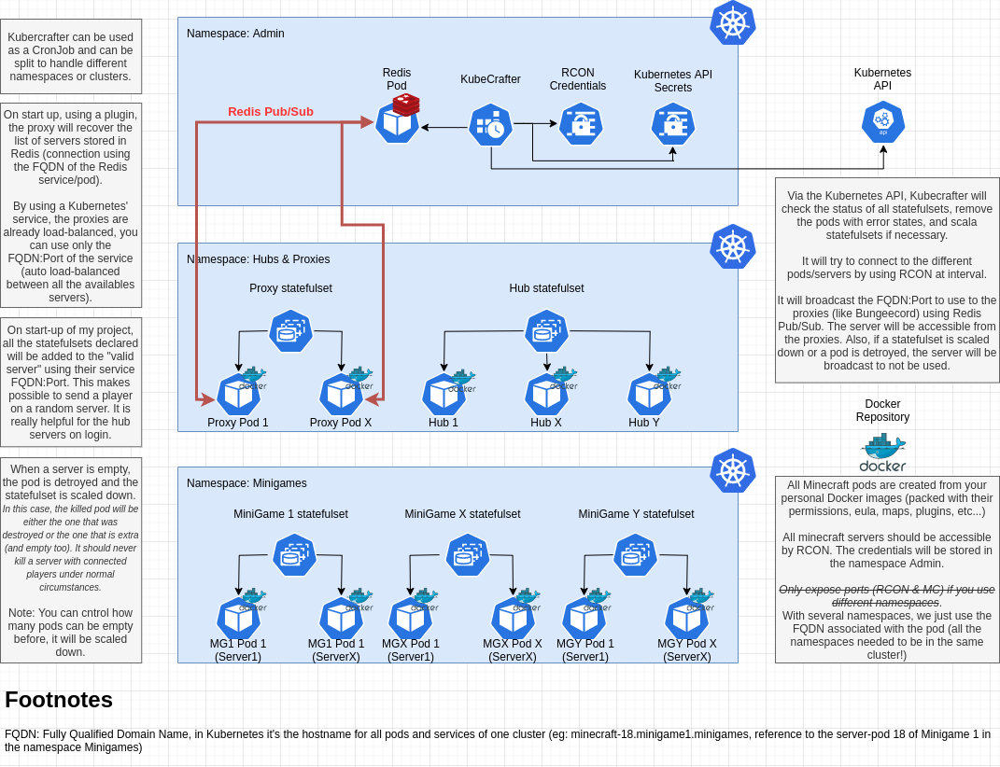

= KubeCrafter
FuseTim <fusetim@gmx.com>
20/04/2020
ifndef::env-github[:icons: font]
ifdef::env-github[]
:outfilesuffix: .adoc
:caution-caption: :fire:
:important-caption: :exclamation:
:note-caption: :paperclip:
:tip-caption: :bulb:
:warning-caption: :warning:
endif::[]

Kubernetes network manager of minecraft servers.

NOTE: The readme needs to be fleshed out.

[WARNING]
=======
No license has been defined for the moment. Please respect property rights.

However, you can use it for experimentation purposes (limited to the private sphere) only.
=======

== The idea

== Contributors

- FuseTim <fusetim@gmx.com> -- Main developer